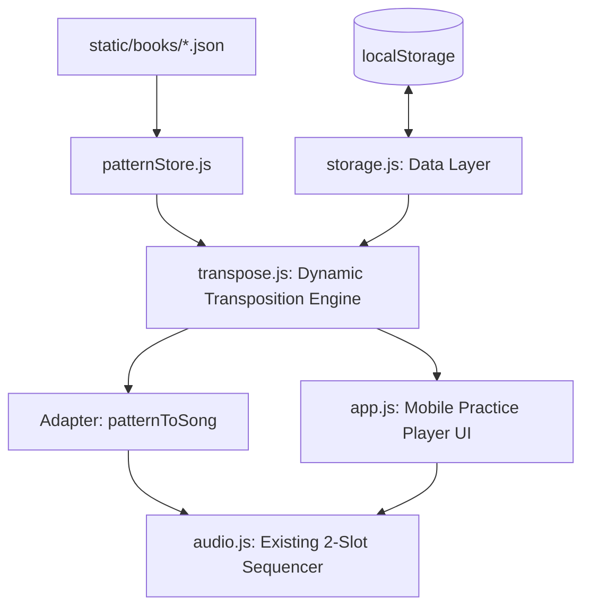

# Cadence 제품 구조 개혁 계획 (개정안)

이 문서는 Cadence 앱을 직접 코드를 입력하는 경량 시퀀서에서 **"패턴 라이브러리 기반의 모바일 반복 연습 도구"**로 재정의하기 위한 아키텍처 개편 및 구현 계획서입니다. 이전 초안의 자기 비판(Self-Criticism) 결과를 반영하여 기술적 위험을 줄이고 확장성을 극대화하도록 개정되었습니다.

---

## 1. 개요 및 핵심 목표

* **서비스의 재정의**: `기타 코드 레시피`나 `재즈 피아노 보이싱` 스타일 교재에 나오는 코드 조각들을 모바일에서 바로 들어보고, 원하는 키로 즉시 전조하여 템포별로 반복 연습할 수 있는 최적의 모바일 UX를 제공합니다.
* **중심 흐름 전환**: `패턴 탐색 -> 키/템포/스트로크 선택 -> 재생/반복 연습 -> 즐겨찾기 저장`을 메인 루프로 설정하고, 기존의 복잡한 코드 편집기는 서브 기능으로 격하시킵니다.

---

## 2. 아키텍처 및 데이터 흐름

자기 비판을 통해 도출된 핵심 구조로, 불필요한 재생 엔진 전면 개편을 피하고 어댑터 패턴과 동적 전조 엔진을 활용합니다.



### 아키텍처 핵심 결정 사항
1. **동적 전조 엔진 (`transpose.js`)**: 각 패턴에 키별 코드를 수동 하드코딩(Variants)하지 않고, 기준 키(Default Key)와 진행 도수(Degrees) 정보를 바탕으로 임의의 12개 키로 실시간 연산하여 전조합니다.
2. **어댑터 패턴 (`patternToSong`)**: 4/4 박자 타임라인 형태의 패턴 데이터를 기존 재생 엔진이 인식하는 `song.sections[].bars[].slots` 구조(1마디당 2개의 2박자 슬롯)로 자동 변환합니다. 이를 통해 엔진 재작성 리스크를 차단합니다.

---

## 3. 데이터 모델 설계

### 3.1. 정적 패턴 데이터 모델 (예: `static/books/guitar-chord-recipes.json`)
도수 정보(`degrees`)와 기본 키 코드(`chords`)를 함께 보관하여 완벽한 동적 전조를 지원합니다.

```json
{
  "bookId": "guitar-chord-recipes",
  "bookTitle": "기타 코드 레시피 (연습용)",
  "patterns": [
    {
      "id": "recipe-01",
      "title": "밝은 메이저 진행 (A-01)",
      "category": "A 멜로디",
      "defaultKey": "C",
      "meter": "4/4",
      "chords": ["C", "F", "G", "Am", "C", "F", "G"],
      "degrees": ["I", "IV", "V", "vi", "I", "IV", "V"],
      "feel": ["strong", "soft", "arpeggio"],
      "difficulty": "Easy"
    }
  ]
}
```

### 3.2. 저장소 데이터 모델 (`localStorage` 관리 포맷)
유지보수와 확장을 고려하여 설정, 즐겨찾기, 최근 연습 기록 및 사용자 커스텀 패턴을 명확히 분류합니다.

```json
{
  "version": 1,
  "settings": {
    "bpm": 90,
    "stroke": "arpeggio",
    "instrument": "guitar"
  },
  "favorites": ["three-min-01"],
  "recent": [
    {
      "patternId": "three-min-01",
      "key": "G",
      "playedAt": "2026-06-17T15:20:00Z"
    }
  ],
  "userPatterns": []
}
```

---

## 4. 핵심 기술 개선 계획

### 4.1. 동적 전조 (Transpose) 알고리즘
* `chordDb.js`에 정의된 근음 오프셋 정보(`ob`)를 바탕으로 반음(Semitone) 단위 연산을 실행합니다.
* **작동 프로세스**:
  1. 선택된 목표 키와 패턴의 `defaultKey` 사이의 반음 거리(오프셋) 계산.
  2. 근음(Root)을 해당 오프셋만큼 시프트하여 타겟 근음 도출 (예: C -> G는 +7 반음).
  3. 분수 코드(Slash Chord) 형태의 베이스 음도 동일한 방식으로 전조 적용 (예: `F/A` -> +7 반음 -> `C/E`).

### 4.2. 코드 해석기 및 `chordDb.js` 확장
* **슬래시 코드 대응**:
  * 입력된 코드명에서 베이스 슬래시(`/`)를 감지하여 추출합니다.
  * 기타 재생 시, 가장 낮은 줄(6번 또는 5번 줄)의 음을 지정된 베이스 노트의 옥타브 음으로 강제 변경하여 풍부한 보이싱을 연출합니다.
* **미등록 텐션 코드 처리 (Dynamic Fallback)**:
  * DB에 고정 폼이 없는 경우, 메이저/마이너 3화음에 입력된 텐션값(예: `add9`)의 인터벌을 계산하여 동적으로 MIDI 음을 가산하는 제너레이터를 구현합니다.

### 4.3. 피아노/재즈 확장 사운드 엔진
* **하드웨어 제약 극복**: 기존의 기타 전용 피지컬 모델링(`pluckString`) 외에, 사인파와 삼각파 오실레이터를 조합한 **간이 피아노 감쇄 합성기**를 추가 도입합니다.
* **보이싱 자동 생성**: 피아노 코드는 양손 보이싱을 하드코딩하지 않고, 주어진 코드명에서 루트리스(Rootless) 가이드 톤과 텐션을 추출하는 알고리즘을 구축하여 연주하도록 설계합니다.

---

## 5. 단계별 구현 로드맵

안정적인 릴리즈를 위해 리스크가 낮은 작업부터 고도화 단계까지 총 4단계로 나누어 진행합니다.

| 단계 | 개발 핵심 내용 | 마일스톤 및 세부 작업 |
| :--- | :--- | :--- |
| **1단계**<br>(코어 인프라) | **동적 전조 및 데이터 레이어** | • static JSON 패턴 파일 추가<br>• 동적 전조 헬퍼 (`transpose.js`) 작성<br>• `storage.js` 구축 (버전 제어, 로드/저장, 마이그레이션) |
| **2단계**<br>(어댑터 연결) | **엔진 호환 및 목업 검증** | • `patternToSong` 어댑터 작성<br>• UI에서 선택한 키에 따라 실시간 전조 오디오 재생 검증 |
| **3단계**<br>(UX/UI 개편) | **모바일 연습 전용 화면** | • 패턴 리스트/검색 UI 뷰 추가<br>• 모바일 친화형 대형 플레이어 컨트롤 구현<br>• 현재/다음 코드 및 운지도 강조 표시 화면 개발 |
| **4단계**<br>(기능 고도화) | **코드 파싱 및 신스 확장** | • `chordDb` 확장 및 텍스트 빠른 입력 파서 기능 추가<br>• 피아노 오디오 신디사이저 렌더러 추가 |

---

## 6. 저장 및 데이터 이동(Import/Export) 안정성

* **유효성 검사 (Schema Validation)**:
  * 외부 파일(.json)을 가져올 때 데이터 오염으로 인한 오동작을 예방하기 위해 아래 검증 스키마를 거칩니다.
  ```js
  function validateImportData(data) {
    if (!data || data.format !== "cadence-export") return false;
    if (typeof data.version !== "number") return false;
    if (!Array.isArray(data.favorites) || !Array.isArray(data.userPatterns)) return false;
    return true;
  }
  ```
* **이름 중복 및 충돌 제어**:
  * 사용자 정의 패턴을 가져올 때 기존 데이터와 ID가 겹칠 경우, 가져온 패턴 ID 뒤에 `-imported` 서픽스 및 고유 타임스탬프를 덧붙여 덮어쓰기 사고를 예방합니다.
