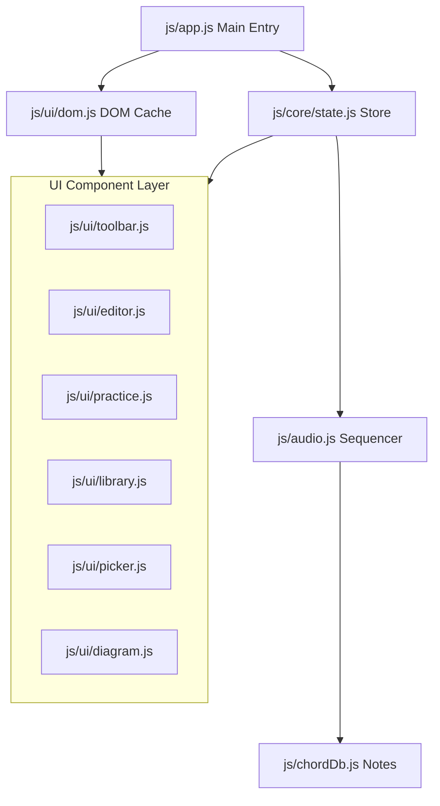

# Cadence 코드베이스 리팩토링 계획서 (Refactoring Plan)

이 문서는 대형 단일 파일로 비대해진 `js/app.js` (~56KB, 1,690+ 라인)를 역할과 책임에 따라 나누고, 모듈식 컴포넌트 아키텍처로 개편하여 유지보수성, 테스트 용이성, 그리고 코드 가독성을 극대화하기 위한 상세 리팩토링 실행 계획입니다.

---

## 1. 현재 구조 분석 및 비판

현재 `js/app.js`는 다음 역할들을 동시에 담당하는 **신의 객체(God Object)** 상태입니다:
1. **상태 관리**: 글로벌 `state` 보관 및 전역 스토리지 연동
2. **도구 모음 제어**: BPM조절, 스트로크 선택, 루프 토글, 플레이 컨트롤 핸들링
3. **편집 그리드 렌더링**: 섹션/마디/슬롯 단위의 복잡한 DOM 트리 빌드 및 이벤트 리스너 할당
4. **연습 모드 렌더링**: 대형 코드 카드 업데이트, 슬라이더 프리뷰 렌더링, A-B 루프 조작, Wake Lock 제어
5. **라이브러리 드로어**: 패턴 검색, 칩 필터링 및 리스트 동적 렌더링
6. **코드 선택 모달**: Root, Quality, Tension, Extension 조합에 따른 동적 그리드 생성 및 Bass Note 아코디언 핸들링
7. **기타 운지 다이어그램**: SVG 요소를 동적으로 연산하여 지판의 운지 점, 바레(Barre) 기호 드로잉

이로 인해 한 부분을 수정(예: A-B 루프 개선)할 때 다른 기능(예: 운지 그리기나 모달 작동)의 코드와 얽혀 레이아웃이나 변수 충돌 위험이 크고 가독성이 떨어집니다.

---

## 2. 목표 아키텍처 (Target Architecture)

UI 요소를 역할별로 분리하고, 전역 상태(State)의 일관성을 보증하는 **중앙 집중형 상태(State/Store) 관리** 모듈을 핵심으로 배치합니다.



### 📂 제안하는 디렉토리 구조

```
js/
├── app.js (진입점: 모듈 초기화 및 각 UI 컴포넌트 이벤트 조율)
├── audio.js (Web Audio 시퀀서 및 재생 제어)
├── chordDb.js (운지 데이터 및 보이싱 연산 엔진)
├── core/
│   ├── transpose.js (키 전조 모듈)
│   ├── storage.js (로컬 스토리지 매니저)
│   ├── patternToSong.js (어댑터)
│   └── state.js (신규: 전역 상태 관리자, Pub/Sub 이벤트 발행 구조)
└── ui/
    ├── dom.js (신규: DOM 요소 참조 캐싱 전용)
    ├── toolbar.js (신규: BPM/플레이백 제어 툴바)
    ├── editor.js (신규: 그리드 코드 진행 편집기)
    ├── practice.js (신규: 연습 모드 - A-B Loop, Wake Lock 제어 포함)
    ├── library.js (신규: 패턴 라이브러리 드로어 및 필터 검색)
    ├── picker.js (신규: 코드 빌더 선택 모달)
    └── diagram.js (신규: SVG 기타 운지 다이어그램 렌더러)
```

---

## 3. 단계별 리팩토링 마일스톤 (Step-by-Step Milestones)

### 🟥 1단계: 코어 분리 및 상태 모듈화 (Core Decoupling)
* **DOM 캐시 추출 (`js/ui/dom.js`)**:
  - `dom` 객체 선언과 `cacheDOMElements()` 함수를 독립 파일로 분리하여 각 UI 컴포넌트가 공통으로 참조할 수 있도록 공유 모듈화합니다.
* **상태 관리 모듈 구축 (`js/core/state.js`)**:
  - 전역 `state` 객체를 캡슐화합니다.
  - 상태가 변경되었을 때 특정 UI 컴포넌트만 구독(Subscribe)하여 업데이트할 수 있도록 간단한 **Pub/Sub 패턴** 또는 반응형 리스너를 구현합니다.
  - 예: `state.subscribe("playbackSlot", (slot) => { ... })`

---

### 🟨 2단계: 독립 UI 컴포넌트 분리 (Independent UI Components)
* **운지 다이어그램 모듈 추출 (`js/ui/diagram.js`)**:
  - `drawChordDiagram(chord, container)` 및 내부 SVG 스트링 빌더 헬퍼들을 분리합니다.
  - `app.js`뿐만 아니라 모달, 연습 카드 등 어디서나 독립적으로 그릴 수 있게 구조화합니다.
* **패턴 라이브러리 드로어 추출 (`js/ui/library.js`)**:
  - 드로어 열기/닫기, 검색어 필터링, 카테고리 칩 렌더링을 격리합니다.
* **코드 선택 모달 추출 (`js/ui/picker.js`)**:
  - 코드 구성을 위한 Root/Quality/Tension 드로잉 로직 및 베이스 아코디언 핸들러를 캡슐화합니다.

---

### 🟩 3단계: 코어 뷰 컴포넌트 분리 (Main Views Separation)
* **재생 툴바 추출 (`js/ui/toolbar.js`)**:
  - BPM 조절 인풋 이벤트, 스트로크 선택, 루프 재생 상태 동기화를 독립 모듈로 떼어냅니다.
* **연습 포커스 뷰 추출 (`js/ui/practice.js`)**:
  - 연습 모드의 A-B Loop, Wake Lock API 상태 관리 및 하단 진행 타임라인 렌더러를 격리합니다.
* **코드 진행 편집기 추출 (`js/ui/editor.js`)**:
  - 에디터 모드의 그리드 렌더링, 슬롯 마크업 바인딩을 격리합니다.

---

### 🟦 4단계: 진입점 통합 및 통합 검증 (`js/app.js` 클린업)
* **`app.js` 경량화**:
  - 모든 분리된 모듈들을 `import`하여 앱 시작점(`DOMContentLoaded`)에서 초기 바인딩을 조율하는 최소한의 중재자(Mediator) 역할만 남깁니다.
  - 코드 라인 수 목표: **150라인 이하**로 축소.
* **회귀 테스트 (Regression Testing)**:
  - 전조, 로컬 저장소 로딩, 포크(Fork to Custom), A-B Loop, Wake Lock 등 핵심 시나리오가 끊김 없이 복구되는지 통합 검증을 시행합니다.

---

## 4. 리팩토링 시 준수해야 할 제약 조건

1. **상호 참조(Circular Dependency) 금지**:
   - `ui/editor.js`가 직접 `ui/picker.js`를 불러와 호출하기보다, `state.js` 또는 `app.js` 중재자를 통해 동작하도록 느슨한 결합(Loose Coupling)을 지향합니다.
2. **동작 유지성**:
   - 리팩토링 과정 중에도 브라우저 내 오디오 동작(Web Audio API 재생 주기)과 저장 로직은 단 한 단계도 깨지지 않고 점진적으로 분할 실행되어야 합니다.
3. **가독성 있는 주석 유지**:
   - 기존의 음악적 튜닝 데이터 및 수식 관련 주석들을 100% 보존해야 합니다.
