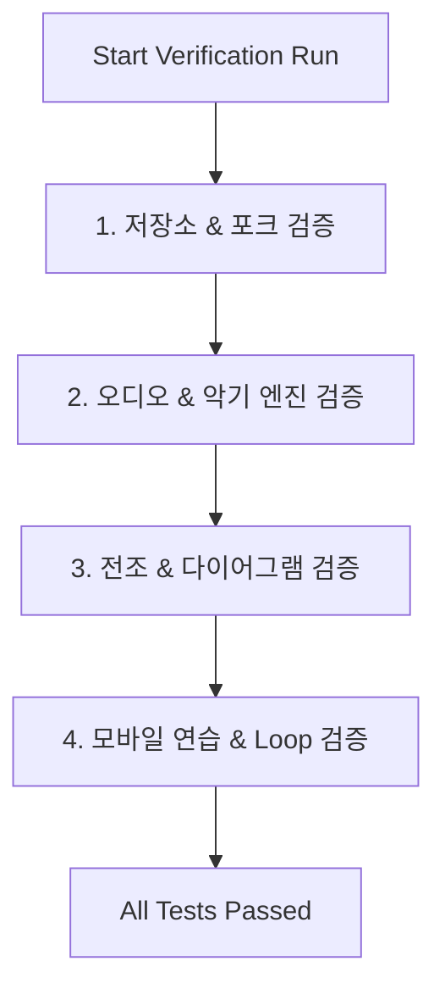

# Cadence 리팩토링 검증 계획서 (Verification Plan)

이 문서는 모듈 구조로 분할되는 리팩토링(R-001 ~ R-010) 진행 중 및 완료 후에, 애플리케이션의 핵심 로직과 음악적 플레이백 기능이 이전과 동일하게 완벽히 작동하는지 확인하기 위한 검증 시나리오 및 체크리스트입니다.

---

## 1. 검증 대상 핵심 기능 (Core Verification Areas)

리팩토링으로 영향받는 범위는 전체 UI와 오디오 재생 루프입니다. 다음 4가지 핵심 구역에 대해 회귀 테스트(Regression Test)를 수행합니다.

---

## 2. 세부 검증 시나리오 (Test Scenarios)

### 2.1. 로컬 저장소 및 자동 포크 (Storage & Fork-to-Custom)
* **목적**: 전역 `state.js` 분리 후에도 기존 로컬스토리지 입출력 및 책 패턴 수정 시 포크가 중단 없이 이루어지는지 검증.
* **검증 절차**:
  1. 페이지 최초 접속 시 기본 곡(Default Song) 또는 마지막에 연주한 곡이 정상 로드되는지 확인.
  2. **패턴 라이브러리 드로어**를 열어 책 패턴(예: `기타 코드 레시피` ➡️ `밝은 메이저 진행`)을 로드.
  3. 로드된 상태에서 임의의 코드 슬롯을 클릭하여 **코드 변경 시도**.
  4. **기댓값**: 슬롯 선택 모달에 진입하는 순간, 헤더 하단의 타이틀이 `자유 연주곡`으로 자동 변경되고 로컬 스토리지에 복제본이 자동 저장되어야 함.

---

### 2.2. 실시간 키 전조 및 다이어그램 연동 (Transpose & SVG Rendering)
* **목적**: 키 변경 시 전조 모듈(`transpose.js`)의 계산값과 픽커/연습 뷰의 SVG 다이어그램이 일치하고, 오디오 음높이가 즉각 전조되는지 확인.
* **검증 절차**:
  1. 책 패턴 로드 상태에서 상단 키 선택 칩(`C`, `G`, `E` 등)을 차례로 클릭.
  2. **기댓값**:
     - 화면의 코드 슬롯 텍스트와 연습 모드의 대형 코드 텍스트가 해당 키에 맞게 즉시 변경되어야 함.
     - 중앙의 SVG 다이어그램 운지 위치(Fret, String Dot)가 변경된 코드를 정확하게 표현해야 함.
     - 재생 도중 키를 변경했을 때 지연(Lag) 없이 음높이가 실시간으로 높고 낮아져 연주되어야 함.

---

### 2.3. 구간 반복 및 오디오 스케줄러 (A-B Loop & Audio Scheduler)
* **목적**: `audio.js`가 새로운 상태 구독 모델 하에서 지정된 루프 영역을 이탈하지 않고 정확히 반복 연주하며, 렌더링 최적화가 제 기능을 하는지 검증.
* **검증 절차**:
  1. 연습 모드로 진입하여 `구간 반복 (A-B Loop)` 버튼을 클릭하여 활성화(ON).
  2. 시작 마디(A)를 `마디 2`, 종료 마디(B)를 `마디 3`으로 선택.
  3. **기댓값**:
     - 하단 타임라인 칩 리스트 중 `마디 2 ~ 3` 영역(슬롯 2~5)에만 은은한 오렌지빛 테두리(`.in-loop-range`)가 표시되어야 함.
     - 드롭다운 값을 바꾸는 과정에서 드롭다운이 자동으로 닫히거나 포커스가 유실되지 않아야 함.
     - 재생 버튼을 누를 시 슬롯 2부터 연주를 시작해 슬롯 5를 연주한 직후 슬롯 2로 정상 wrapping 되어 반복되어야 함.

---

## 3. 브라우저/기기별 환경 호환성 검증

가장 깨지기 쉽고 환경 의존성이 높은 브라우저 API 기능들에 대한 환경별 체크리스트입니다.

| 기능 | 검증 브라우저 / 환경 | 예상 동작 (Expected Behavior) |
| :--- | :--- | :--- |
| **Wake Lock API** | Google Chrome (데스크톱/안드로이드) | 재생 시 `Screen Wake Lock acquired` 로그 발생 및 화면 꺼짐 방지 활성화. |
| **Wake Lock 예외 처리** | Apple Safari (iOS 13 이하) 또는 HTTP 비보안 연결 | 💡 버튼이 반투명 비활성화되며 `💡 화면 켜짐 유지 (미지원)` 문구 및 미지원 안내 툴팁 표시. |
| **Web Audio Context** | Mobile Safari / iOS Chrome | 오토플레이 방지 규정 우회 확인. 사용자의 첫 Play 터치 시점에 AudioContext가 `suspended` 상태에서 `running`으로 무사 변환 및 소리 출력 확인. |
| **반응형 뷰포트** | 모바일 세로 화면 시뮬레이션 (360px ~ 412px) | 상단 제어 바가 두 줄로 자연스럽게 wrap 되어 중앙 정렬되며, 재생/정지 버튼이 하단 1열로 넓게 배치되는지 확인. |

---

## 4. 품질 지표 (Quality Metrics)

리팩토링 성공 여부를 판단하는 비기능적 품질 지표입니다:
1. **코드 응집성**: 단일 파일 내 UI 템플릿 스트링과 핵심 뮤테이션이 혼재하지 않고 독립 파일로 격리되어 있을 것.
2. **번들 크기 효율**: 개별 컴포넌트의 가독 라인 수가 300라인을 넘지 않을 것. (`app.js`는 150라인 이하)
3. **콘솔 청결성**: 에러 없이 작동하며, 개발 모드에서의 `State Mutation` 발행 내역만 정돈되어 출력될 것.
